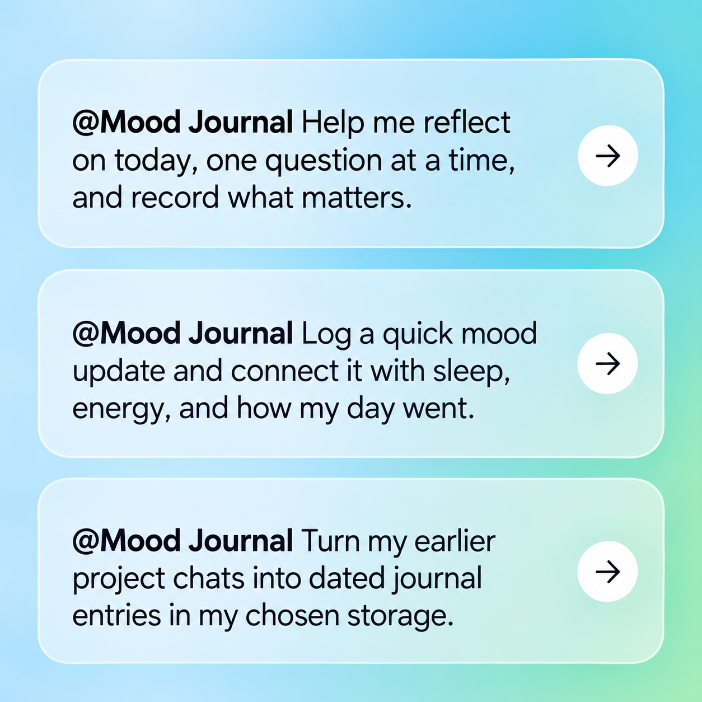

# Mood Journal

A single-agent, storage-neutral journaling skill for ChatGPT and compatible skill hosts. It supports thoughtful mood check-ins, brief health/event updates, future inquiry topics, and evidence-bound clinician handoffs. It is adapted from an existing journaling workflow without altering that installed skill.

**Use the storage available to the host.** Prefer complete, verified journal files or records. A single persistent file or memory item can work without a storage plugin. Native retained conversations inside or outside projects provide a limited cloud/mobile fallback, with explicit retention and retrieval limits. If no persistent destination exists, the skill reports that rather than claiming a save.

**Cloud/mobile design:** the plugin needs no local executable or storage connector. It can use native retained project context, memory, or exposed durable file capabilities. Automated native project-file creation/read-back remains unverified; the fallback does not claim that capability. User-assisted project saving is not the selected design. Live installation and cross-device tests remain pending. See [runtime capability notes](docs/capabilities.md), [native storage research](docs/native-storage-research.md), and [submission preparation](submission/README.md).



**Project tracking:** [development hub](https://github.com/squizzeak/mood-journal-plugin/discussions/11), [issues](https://github.com/squizzeak/mood-journal-plugin/issues), and [design discussions](https://github.com/squizzeak/mood-journal-plugin/discussions). GitHub is the authoritative development tracker.

**Getting started:** follow [installation](#installation), then begin a journal chat. The skill explains available storage and project modes before recording your choices. For release downloads, use the artifacts produced by [GitHub Actions](https://github.com/squizzeak/mood-journal-plugin/actions/workflows/release.yml); directory approval and live cloud/mobile acceptance are still pending.

## Table of contents

- [Single-agent chat operation](#single-agent-chat-operation)
- [Handoff version integrity](#handoff-version-integrity)
- [Informed first-use setup](#informed-first-use-setup)
- [Overview](#overview)
- [Capabilities](#capabilities)
- [Projects are optional](#projects-are-optional)
- [Storage and cross-device support](#storage-and-cross-device-support)
- [Installation](#installation)
- [Submitting to the OpenAI plugins directory](#submitting-to-the-openai-plugins-directory)
- [Using the skill](#using-the-skill)
- [Importing earlier chats and upgrading storage](#importing-earlier-chats-and-upgrading-storage)
- [Repository layout](#repository-layout)
- [Release artifacts](#release-artifacts)
- [Manual releases and versioning](#manual-releases-and-versioning)
- [Validation](#validation)
- [Privacy and clinical boundaries](#privacy-and-clinical-boundaries)
- [License and provenance](#license-and-provenance)

## Overview

Mood Journal is a skills-only plugin: instructions and resources, without an MCP server, account, telemetry, executable runtime hook, or hosted journal service. It adapts to capabilities the host actually exposes. The release tooling runs only during development or GitHub Actions; Python, Git, and GitHub CLI are not journaling runtime requirements.

The portable `plugin.json` identifies the package. An OpenAI presentation extension and a matching `.codex-plugin/plugin.json` compatibility manifest provide discovery metadata. A repository marketplace supports GitHub import and local testing. [Official package documentation](https://developers.openai.com/plugins/build/plugins).

## Capabilities

| Capability | What it does | Important behavior |
| --- | --- | --- |
| Full journaling | Opens with the user's agenda and explores one question at a time. | Stages all discussion-derived changes until explicit close. |
| Impromptu reflection | Recognizes a sustained personal reflection without restarting it. | Obtains journal intent if unclear; does not silently record emotional conversation. |
| One-off updates | Saves an intentional brief mood, health, or event log. | Usually no follow-up or numeric-rating demand; compact entry. |
| Holistic context | Connects reported emotions, body state, sleep, energy, relationships, coping, and functioning. | Does not infer unreported symptoms or medication adherence. |
| Continuity | Retrieves relevant recent records and current corrections. | Today's report outranks history; one relevant continuity bridge at a time. |
| Agenda coverage | Tracks covered, deferred, withdrawn, and unreached topics. | Respects the user's end; does not create reminders automatically. |
| Exact wording | Preserves meaningful quotes and voice uncertainty. | Separates direct report, recalled speech, and assistant reflection. |
| Verified persistence | Uses stable session IDs, duplicate checks, exact reads, and safe updates. | Reports partial failure accurately; never confuses acknowledgement with verification. |
| Future inquiries | Stores topics to revisit in a future session and tracks dispositions. | Undated topics are not scheduled notifications. |
| Clinician summary | Creates a concise first-person speaking script with sources. | Preserves dated versions and an explicit verified coverage interval. |
| Intermediate preview | Gives a read-only handoff progress report in chat. | No artifacts, source consumption, or cutoff movement. |
| Source packet | On explicit request, assembles an overview and full-source PDF-only ZIP. | Requires rendering/export tools, page inspection, text checks, and checksums. |
| Optional exercises | Offers free writing, gratitude, decision reflection, or periodic reviews. | No forced positivity, regimen, or promised clinical outcome. |
| Historical chat ingestion | Converts selected accessible project chats into source snapshots, transcripts, a ledger, and synthesized journal files. | Exact source retrieval, explicit scope, dated provenance, and duplicate-safe import; never equates memory snippets with full chats. |
| Automatic migration policy | Detects newly available storage at session start/resume and migrates under a previously approved project/destination policy. | Opt-in once; resumable and verified; no background install listener or silent transfer to a new account. |
| Later storage installation | Migrates earlier chat or memory-backed entries into newly authorized full storage. | Preserves originals, maps old/new IDs, verifies each import, and resumes partial migrations without duplicates. |
| Voice recovery | Preserves original timestamps and staged synthesis across interruptions. | Disconnection is not permission to save. |

Full entries use stable headings for session details, synthesized account, mood, events, bodily context, coping/functioning, needs/follow-up, and provenance. One-off updates stay short. Unsupported domains remain explicitly unknown or not discussed. The complete behavior is in [SKILL.md](plugins/mood-journal/skills/mood-journal/SKILL.md) and its linked references.


## Projects are optional

A journal has a stable identity independent of its ChatGPT Project, current conversation, or storage provider. Use the same selected journal from ordinary chats or projects whenever its authorized backend is accessible. Backend migrations preserve that identity. If several journals are available, select the intended one before accessing history; matching names do not authorize merging.

Without a storage plugin, an ordinary retained chat can hold a complete dated entry, with host-managed retention and no independent save receipt or guarantee of exact retrieval in later chats. A native full record/file can be used if actually exposed. No durable destination means explicitly unsaved reflection. No mandatory manual Save-to-project step is introduced.

Historical import outside projects accepts explicitly selected chats, exports, or an authorized source ledger. It does not silently search or import the whole account. Automatic import preferences bind to the journal and exact source scope, not merely a project name.

Users may opt into a require-project policy for a journal. The skill checks trusted host project identity and pauses journal retrieval, writes, and migration outside the allowed project or when identity is unknown. This is behavioral enforcement, not a directory manifest restriction or security boundary. It does not prevent host chat retention; an explicit user policy change can disable it. No such restriction is enabled by default.

### Projects remain supported for organization

Use a ChatGPT Project to organize related journal chats, instructions, and sources, and optionally a backend project/folder/collection to organize stored records. These are separate containers. Track organizational membership independently from journal identity and storage routing, so renaming or moving a project does not create a new journal. A project may contain several distinct journals; do not merge them automatically. Project-scoped imports remain available, with explicit source and journal boundaries. Creating/moving native projects depends on actual host tools; optional organization setup never becomes a manual per-entry saving requirement.

## Storage and cross-device support

| Destination | Requirement/status |
| --- | --- |
| Native ChatGPT cloud project storage | Prefer exposed durable file operations. Automatic project-source writes remain unverified; retained native project conversations provide a limited fallback. |
| Mobile ChatGPT | No local runtime required. Uses exposed storage or retained project context; live mobile validation remains pending. |
| Existing memory framework | Compatible by capability, subject to the backend's permissions and actual tools. No vendor-specific integration is installed by this package. |
| Authorized local files | Can satisfy persistence on a local host. Does not imply cloud synchronization or mobile access. |
| Single-file or single-record memory | Read/append dated blocks when full content fits; otherwise label compact summaries and keep full entries in retained project conversations. |
| Retained project chat / temporary download | Retained chat can hold the entry with limited retrieval guarantees. A temporary download alone is not durable persistence. |

An established destination is reused. Initially, the sole capable installed storage plugin is the default; with multiple capable plugins, an available native option is the default. Users may choose any capable native or plugin backend. If multiple plugins exist without native persistence, the skill asks for a destination. It discloses the selected mode; it never silently selects a new service for health records. Store journals outside the plugin/repository. Use the same authorized durable namespace across devices only after verifying those devices can access it. [Storage contract](plugins/mood-journal/skills/mood-journal/references/storage.md).

## Installation

### Public ChatGPT directory, including mobile/cloud

After a publisher submits the skills-only bundle and OpenAI approves and publishes it, users can install it through the directory available to their account. This repository is not yet published there. Installing a local checkout does not install a plugin in cloud/mobile chats. Use the strongest persistent mode available; a directory listing does not guarantee that a particular device exposes file or memory-write tools. See [submission materials](submission/README.md).

### Local desktop authoring/test installation

Clone this repository or extract the `marketplace.zip` into a new directory. With Codex CLI available, run from that directory:

```bash
codex plugin marketplace add .
```

Refresh the desktop app, locate **Mood Journal** under **Mood Journal Plugins**, install it, and start a fresh conversation. Use an authorized journal destination or the documented native project-context fallback before testing. No command here modifies a pre-existing `journaling` skill. The plugin's skill name is `mood-journal`.

To use a GitHub source after pushing, substitute your actual repository for `OWNER/REPOSITORY`:

```bash
codex plugin marketplace add OWNER/REPOSITORY --ref main
```

These are authoring/local marketplace commands; use the app to install and test. [Official marketplace setup](https://developers.openai.com/plugins/build/plugins).

### ChatGPT workspace GitHub import

A workspace admin can import the repository using **Admin → Plugins → Add → Import marketplace**, with Path empty for the root catalog, and select a branch/tag/commit. Workspace access policies remain admin-controlled. This is workspace distribution, not public directory publication or proof of mobile storage support. [Official workspace import](https://learn.chatgpt.com/docs/enterprise/plugin-management).

### Skill-only hosts

Extract `skills.zip` and install its `mood-journal` directory using that host's supported skill installer. Keep the full directory: references, metadata, and notices are required. Do not overwrite another installed skill. Skill portability does not grant filesystem or memory permissions.

## Submitting to the OpenAI plugins directory

Track actual submission and reviewer follow-through in [issue #2](https://github.com/squizzeak/mood-journal-plugin/issues/2). The detailed [submission guide](submission/README.md) explains the skills-only route, artifact choices, required listing material and live acceptance evidence. Recheck the [official submission instructions](https://developers.openai.com/plugins/deploy/submission) and actual portal before submitting.

1. Gather verified publisher identity/access, public website/support/privacy/terms URLs and country availability in issues [#7](https://github.com/squizzeak/mood-journal-plugin/issues/7), [#6](https://github.com/squizzeak/mood-journal-plugin/issues/6) and [#5](https://github.com/squizzeak/mood-journal-plugin/issues/5).
2. Record real cloud/mobile/storage acceptance results in [#3](https://github.com/squizzeak/mood-journal-plugin/issues/3), and populate/review manifests, listing copy and submission worksheets in [#12](https://github.com/squizzeak/mood-journal-plugin/issues/12). Do not invent attestations or mark unrun tests complete.
3. Once the materials are ready, generate and verify the exact submission artifacts using GitHub Actions in [#13](https://github.com/squizzeak/mood-journal-plugin/issues/13). Local artifacts suffice for development build testing; official release artifacts are not needed during information gathering.
4. Complete accurate portal attestations, submit the accepted package format through the skills-only route, record the version and receipt/status, and track review feedback in #2. After approval, complete any publication step and verify the directory listing.

After an actual stable release, the [submission preparation workflow](.github/workflows/prepare-submission.yml) can verify published assets and prepare editorial drafts. Optional Copilot generation is off by default; see the [automation instructions](submission/README.md#automated-preparation-and-copilot) and [billing explanation](submission/README.md#billing-and-the-existing-chatgpt-subscription). Our existing ChatGPT subscription can support interactive drafting/testing, but does not pay for Copilot or OpenAI API calls. Automatic OpenAI portal submission is not implemented because a supported public submission API has not been established.

GitHub has native blocked-by relationships between these tasks. A GitHub issue does not technically prevent someone from using the external submission portal; it records the required project sequencing. A public repository, local build, or GitHub release is not OpenAI approval.

## Using the skill

After choosing the available storage mode, try:

- “Use Mood Journal to help me reflect on today.”
- “Log a quick update: I felt calmer after my walk.”
- “Next time we journal, ask me about my appointment.”
- “I'm finished; save this session.”
- “Give me an intermediate therapist update without changing the handoff cutoff.”
- “Prepare a handoff summary from my recent journal entries.”

In hosts with `$` invocation, use `$mood-journal`. A session save request authorizes the agreed journal write; it does not authorize sending records to others. “Don't save this” is honored, while the host's independent chat-retention behavior remains outside the skill's control.

## Importing earlier chats and upgrading storage

### Backend selection and migration

Users can select any capable installed or native storage option. An established choice persists. Initially, one capable installed storage plugin is the default; multiple capable plugins default to native storage when available. If native persistence is unavailable, ask for a destination instead of picking a service arbitrarily. No plugins falls back to available native/local persistence. Defaults never invent file capabilities or authorize historical transfers.

“Move my journal to [backend] and use it for future entries” migrates canonical records and switches routing after verification. Source disposition is selectable: retain (default), archive, or explicitly scoped deletion. Verify the destination and cutover before cleanup; never delete full originals after a lossy summary-memory/chat-only migration. Interrupted copies resume from the ledger; failed cleanup stays pending without reverting successful future-save routing. Unrelated/shared data is excluded. Native archival/deletion is offered only where real tools support it.


Ask: “I have connected storage now. Import the earlier journal conversations in this project into it, preserving dates and sources.” The skill inventories accessible sources, replays sessions chronologically, and builds the same canonical journal entries, supported context revisions, inquiry records, and indexes that the live workflow would have maintained. It verifies each record and keeps an old-to-new locator ledger. Transcripts and a synthesis queue alone do not count as completion. Existing chats and memory remain intact. A partially migrated history stays explicitly partial. Installing the plugin alone never triggers migration. To opt in, say “Automatically migrate this project’s journal history when my chosen storage becomes available.” The skill records the scope/destination and checks on later session starts/resumes. It does not run while no conversation is active.

If the host cannot enumerate or read previous project chats, use an explicitly selected export/transcript set. The optional `skills/mood-journal/scripts/ingest_chats.py` inside the plugin accepts a ChatGPT conversations export and an explicit JSON array of chat IDs. It produces full selected source snapshots, readable active-branch transcripts, a source ledger, and a synthesis queue. It does **not** generate semantic journal summaries itself; the skill performs that second phase against the sources. Python is optional and is not required when native tools can perform equivalent operations.

```bash
python3 plugins/mood-journal/skills/mood-journal/scripts/ingest_chats.py conversations.json --ids-file selected-chat-ids.json --output /your/private/journal/import-2026-09-12
```

Use a new private output directory, outside this public repository. `selected-chat-ids.json` must contain only the conversation IDs selected for import, for example `["fictional-chat-1"]`. Export structure can vary; unsupported structures fail explicitly. Original exports remain untouched. See [historical ingestion](plugins/mood-journal/skills/mood-journal/references/history-ingestion.md) for source completeness, branch handling, resumability, and handoff boundaries.

## Repository layout

```text
.agents/plugins/marketplace.json
.github/workflows/{ci,release}.yml
plugins/mood-journal/
  plugin.json
  .codex-plugin/plugin.json
  assets/{logo.png,logo.svg,example-prompts.png}
  skills/mood-journal/
    SKILL.md
    agents/openai.yaml
    references/{setup,storage,records,inquiries,handoffs,prompts,history-ingestion}.md
    scripts/{ingest_chats,select_handoff}.py
    LICENSE
    NOTICE.md
scripts/{validate,release}.py
tests/
submission/
docs/native-storage-research.md
README.md  CHANGELOG.md  LICENSE  NOTICE.md  PRIVACY.md  TERMS.md
```

## Release artifacts

| Artifact | Purpose |
| --- | --- |
| `mood-journal-VERSION-directory.zip` | Portable plugin root, OpenAI metadata, all skills/resources, logo, and notices; no development scripts or local marketplace. |
| `mood-journal-VERSION-skills.zip` | Self-contained skill bundle for a skills upload/install surface. |
| `mood-journal-VERSION-marketplace.zip` | Repository catalog plus plugin tree and documentation for desktop/workspace distribution. |
| `mood-journal-VERSION-submission-kit.zip` | Listing worksheet, positive/negative test cases, policy drafts, logo, prompt preview image, and test-result worksheet. |
| `RELEASE-NOTES.md` | Incremental changes from commit subjects. |
| `BUILD-INFO.json` | Version, source commit, dirty-tree status, and artifact hashes. |
| `SHA256SUMS` | SHA-256 checksums for all generated deliverables above. |

Archive contents are explicit and drawn from tracked paths. Every ZIP is checked for corruption. Identical inputs produce identical ZIP bytes. Do not commit sensitive files even within allowlisted paths. GitHub's automatic source archives are separate and are not the recommended portal upload.

## Manual releases and versioning

Requires Python 3.11+, Git, and GitHub CLI in the release environment. GitHub-hosted Ubuntu provides the latter two; the workflow selects Python. The plugin runtime needs none of these.

The source repository is [squizzeak/mood-journal-plugin](https://github.com/squizzeak/mood-journal-plugin). GitHub Actions produces the authoritative initial and subsequent release artifacts. Local builds are validation-only and are not distributed as official releases.

With `main` as the default branch, open **Actions → Release → Run workflow**. Default `publish=false` builds downloadable Actions artifacts without pushing a release. Set `publish=true` to commit version/changelog changes, atomically push the default branch and new tag, then create a GitHub draft, upload artifacts, and publish it. The release workflow is only `workflow_dispatch`; CI on push/PR does not publish. [Manual workflow guidance](https://docs.github.com/en/actions/how-tos/manage-workflow-runs/manually-run-a-workflow).

Versions use strict-SemVer-compatible UTC calendar versioning `YEAR.(MONTH*100+DAY).SEQUENCE`. Examples: `2026.912.0`, another release that day `2026.912.1`, and January 2 `2027.102.0`. Numeric components have no leading zeroes. Every existing same-date tag reserves its sequence, including unpublished tags.

The baseline is the newest published, non-draft, non-prerelease GitHub release by publication time whose tag is an ancestor of the selected commit. All release pages are fetched. An initial release uses all history. Each later release lists only commits after its baseline; ordinary and Conventional Commit subjects both work. Tool-generated `chore(release): v...` commits are excluded. No new content means no release. An unrelated release history fails rather than silently generating an initial changelog.

The workflow serializes releases. Publishing requires default-branch dispatch and `contents: write`; branch/tag rules must allow that push. It does not bypass branch protection. If a concurrent push occurs, Git's atomic non-force push fails rather than overwriting it. If repository policy forbids bot pushes, leave publishing disabled until the maintainer arranges an authorized release branch/update process.

For local artifact checks after committing the source:

```bash
python3 scripts/validate.py
python3 -m unittest discover -s tests -v
python3 scripts/release.py build
```

`build` packages the current version without inventing a published release. To test version preparation in a disposable clone, provide a JSON array of real GitHub release metadata (`[]` only for a confirmed first release), then run `python3 scripts/release.py prepare --releases-json releases.json`. Preparation requires a clean tree and changes both manifests plus CHANGELOG.md. Build metadata records whether the source tree was modified.

If publishing fails after the atomic push, preserve the tag. Download that run's artifacts and use GitHub's release UI to create/complete the draft for the existing tag, upload the exact artifacts, paste RELEASE-NOTES.md, and publish after checking them. Do not delete/reassign the tag or rerun version preparation as a recovery shortcut. If failure occurred before the push, rerun normally. Public plugin updates still require the directory's review process; a GitHub release does not update that directory automatically.

## Validation

```bash
python3 scripts/validate.py
python3 -m unittest discover -s tests -v
python3 scripts/validate.py --submission
```

The first two validate package invariants and release behavior. The last deliberately fails until publisher metadata, actual platform tests, and attestations are completed. It is a local completeness gate, not OpenAI's validator. [Behavioral scenarios](tests/behavioral-scenarios.md) cover save timing, missing storage, exact quotes, interruption, privacy, and handoff cutoff handling. Live cloud/mobile tests are explicitly **not run** in the initial kit.

## Privacy and clinical boundaries

The plugin contains no journal data and runs no background collection. It preserves distinctions between historical and current state, self-report and interpretation, and unassessed and absent findings. It does not diagnose, prescribe, or send clinician reports automatically. See [PRIVACY.md](PRIVACY.md) and [TERMS.md](TERMS.md). Public publisher URLs and identity need completion before directory submission.

## License and provenance

CC BY-SA 4.0, retaining attribution to Sunny Patneedi's Claude Starter Kit and the local journaling adaptation. [NOTICE.md](NOTICE.md) records changes and source-file hashes; [LICENSE](LICENSE) identifies the terms. No personal journal, medical history, private record IDs, or account configuration is included. User-created journals are not licensed by this package.

## Informed first-use setup

The skill explicitly asks for operational preferences before first journal-history retrieval or saving, after explaining capabilities, limitations, benefits and drawbacks. Project choices are: no preferred project, a preferred project for organization while remaining usable elsewhere, or a required project with the disclosed limits of behavioral enforcement. Storage selection is separate and covers actual full-record, local, single-record, summary-memory, retained-chat or unsaved options. The plugin-count defaults are recommendations the user accepts or overrides, not silent choices.

Setup records the selected journal, project preference, backend, saving behavior and manual/disabled/automatic historical-import policy. It explains save timing and the absence of a guaranteed background import listener. Previously explicit choices are reused; only missing or materially changed preferences require questions. Users can say “show my journal settings,” “explain the modes,” or “change my journal setup.” Configuration is conversational and stored in authorized journal storage where possible; there is no custom installer, native settings panel, or permission toggle. Configuration writes do not save unfinished journal content or authorize historical copying/deletion. Unverified preference persistence is disclosed.

## Handoff version integrity

Before a numbered handoff, the skill inventories the complete relevant series, including archived/reserved versions, and compares sequence numbers numerically. It must not branch from an old first search result: fictional v2 followed by a discovered v8 yields v9. Canonical parent, highest reserved number, and verified coverage baseline are tracked separately. Unresolved drafts, duplicate versions, missing lineage, or incomplete retrieval block authoritative numbering and leave coverage unchanged. The skill refreshes the inventory before writing, uses atomic allocation when available, and verifies the final record/index. Without atomic backend support, race prevention is best effort and is disclosed. An optional dependency-free inventory checker and fictional regression tests exercise selection; no Python runtime is required for native skill use.

## Single-agent chat operation

This release is for direct interaction with one primary assistant. It performs the conversation, historical import, handoff preparation, verification, and all saves itself. Sub-agents, delegated read-only review, cross-chat task dispatch, and autonomous background agent work are unsupported. Direct tool calls and deterministic helpers remain available. Approved automatic import runs during the active chat.

This is a skill behavior rule, not a plugin permission that disables host agent tools or globally locks other chats. Sequential cross-device use remains supported. Ordinary revision checks, highest-handoff-version discovery, and safe retries remain necessary even with one agent. No multi-agent infrastructure or lock service is required. Future narrowly scoped delegation is a separate development consideration, not an enabled mode.
